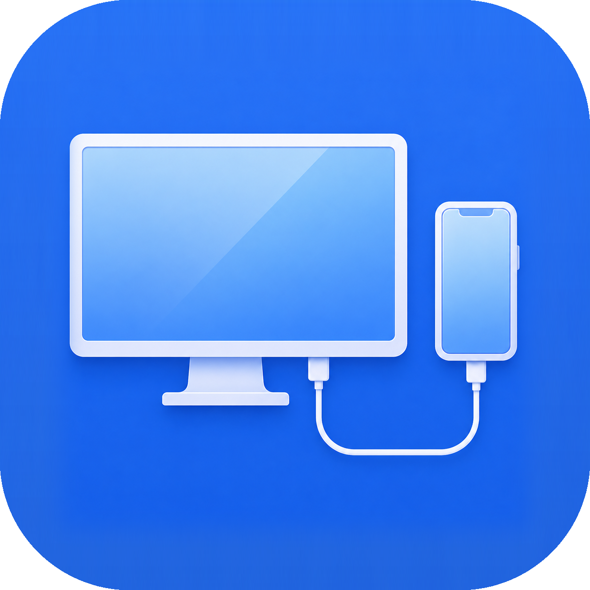

<p align="center">
  
</p>

<h1 align="center">MirrorPhone</h1>

<p align="center">Mirror iPhone, iPad, and Android screens over USB on macOS.</p>

MirrorPhone is a native Swift and AppKit application for viewing mobile devices from a Mac. It uses the system USB capture path for iPhone and iPad, and ADB for Android. Android devices can also be controlled with the Mac's mouse, trackpad, and keyboard.

All device communication stays local. MirrorPhone does not use a network service or cloud relay.

## Platform support

| | Video | Audio | Input |
| --- | --- | --- | --- |
| iPhone and iPad | USB capture through CoreMediaIO and AVFoundation | Included in the muxed capture stream | View-only |
| Android | ADB `screenrecord`, decoded with VideoToolbox | Android 11 or later; device-dependent | Mouse, trackpad, and keyboard on Android 11 or later |

iOS and iPadOS do not expose a public system-wide input-injection API comparable to Android's ADB interface. MirrorPhone therefore does not forward input to Apple mobile devices.

## Features

- Automatic discovery of connected iPhone, iPad, and Android devices
- Low-latency native video decoding and orientation changes
- iPhone and iPad audio through the USB capture stream
- Android taps, drags, scrolling, text entry, navigation keys, and keyboard shortcuts
- Automatic recovery when Android's `screenrecord` session reaches its time limit
- Actual-size display mode and PNG frame capture
- No iOS companion app or Android APK installation

For Android audio and input, the build packages small dex helpers that are copied to `/data/local/tmp` and launched as the ADB shell user with `app_process`. They are not installed as applications.

## Requirements

- macOS 14 or later
- Xcode with a Swift 6.2 toolchain
- A data-capable USB cable
- Android SDK Platform Tools (`adb`) for Android support
- Android SDK platform files, Build Tools (`d8`), and a JDK for Android audio and input support

The video-only iPhone and iPad build does not require the Android SDK.

## Build

Clone the repository, then run:

```sh
./build-debug.sh
open MirrorPhone.app
```

Despite its name, `build-debug.sh` builds an optimized executable by default because the H.264 decode path must keep pace with high-refresh-rate displays. Set `MIRRORPHONE_BUILD_CONFIGURATION=debug` when a debug build is required.

The script packages the app, bundles `adb` from `PATH` or the standard Android SDK location, and builds the Android helpers when the required SDK tools are available. Missing Android helper dependencies do not stop the build; the affected audio or input feature is disabled instead.

Useful build overrides:

| Variable | Purpose |
| --- | --- |
| `MIRRORPHONE_SIGNING_IDENTITY` | Code-signing identity; falls back to ad hoc signing when none is available |
| `MIRRORPHONE_BUILD_CONFIGURATION` | Swift build configuration, `release` or `debug` |
| `MIRRORPHONE_ANDROID_AUDIO_JAR` | Runtime path to a prebuilt Android audio helper |
| `MIRRORPHONE_ANDROID_INPUT_JAR` | Runtime path to a prebuilt Android input helper |

Run the test suite with:

```sh
swift test
```

## Connect a device

### iPhone or iPad

1. Connect the unlocked device by USB.
2. Tap **Trust** on the device if prompted.
3. Allow video access when macOS requests it.
4. Allow microphone access to hear device audio. Denying it leaves video capture available.

The device remains view-only in MirrorPhone.

### Android

1. Enable Developer options and USB debugging.
2. Connect the unlocked device by USB and select a USB mode that permits debugging, such as File Transfer.
3. Accept the **Allow USB debugging** prompt on the device.

Click or drag in the mirrored display to send touch input. Mouse-wheel and trackpad scrolling are translated into swipe gestures. When the MirrorPhone window is active, text, navigation keys, and common Command-key shortcuts are forwarded to Android.

Android audio and input require Android 11 or later. Audio capture depends on Android version and vendor policy; unsupported devices continue mirroring without sound. The phone may be muted while its output is routed to the Mac.

## Application shortcuts

| Shortcut | Action |
| --- | --- |
| <kbd>Command</kbd> + <kbd>0</kbd> | Show the current frame at actual size |
| <kbd>Command</kbd> + <kbd>S</kbd> | Save the current frame as a PNG |

## Release build

`build-dmg.sh` creates a signed, notarized disk image:

```sh
MIRRORPHONE_TEAM_ID="YOUR_TEAM_ID" \
MIRRORPHONE_NOTARY_PROFILE="YOUR_NOTARYTOOL_PROFILE" \
./build-dmg.sh 1.0.0
```

Set `MIRRORPHONE_SIGNING_IDENTITY` if more than one Developer ID Application certificate is installed. The finished disk image is written to `dist/`.

## Contributing

Bug reports and pull requests are welcome. Please include the macOS version, device model, mobile OS version, and relevant build or runtime output when reporting device-specific problems.
